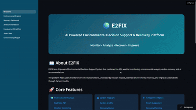
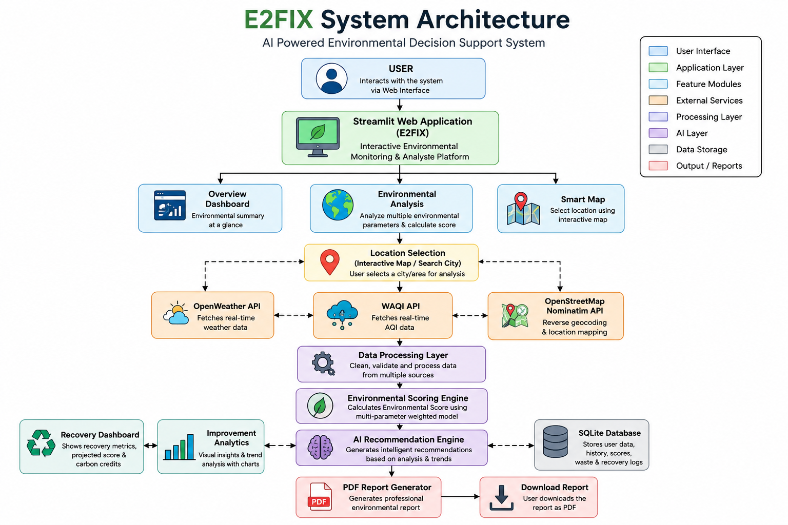
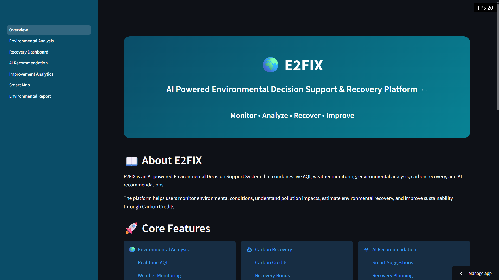
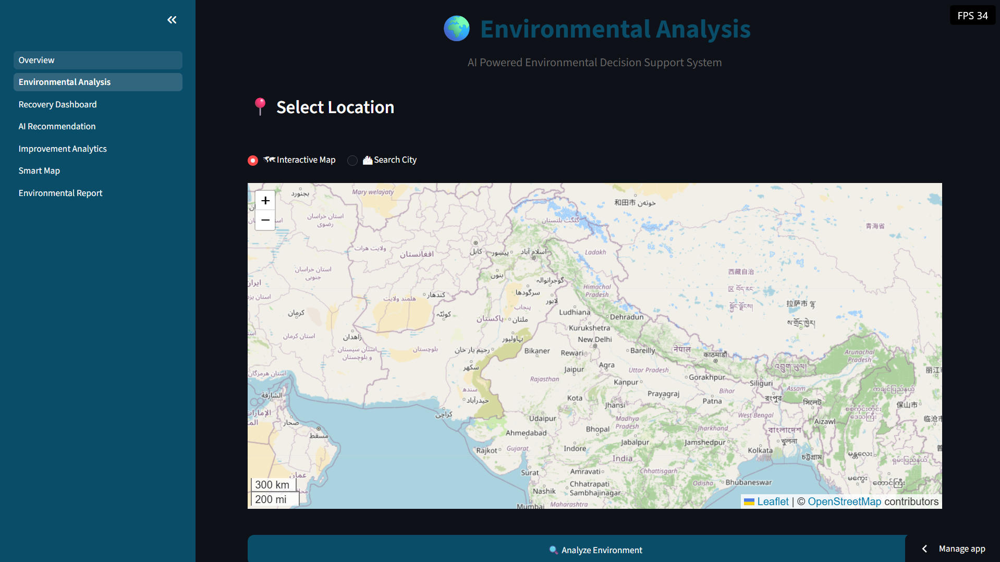
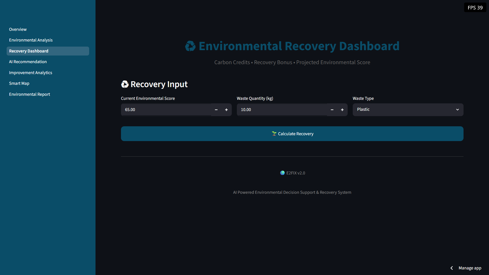
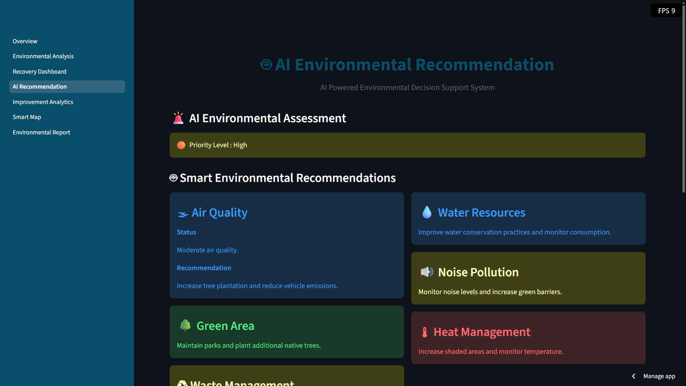
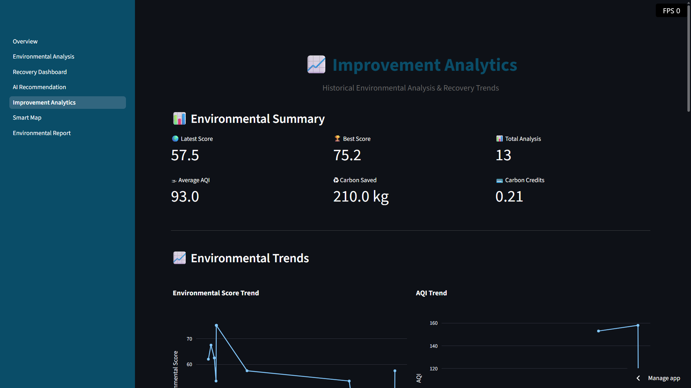
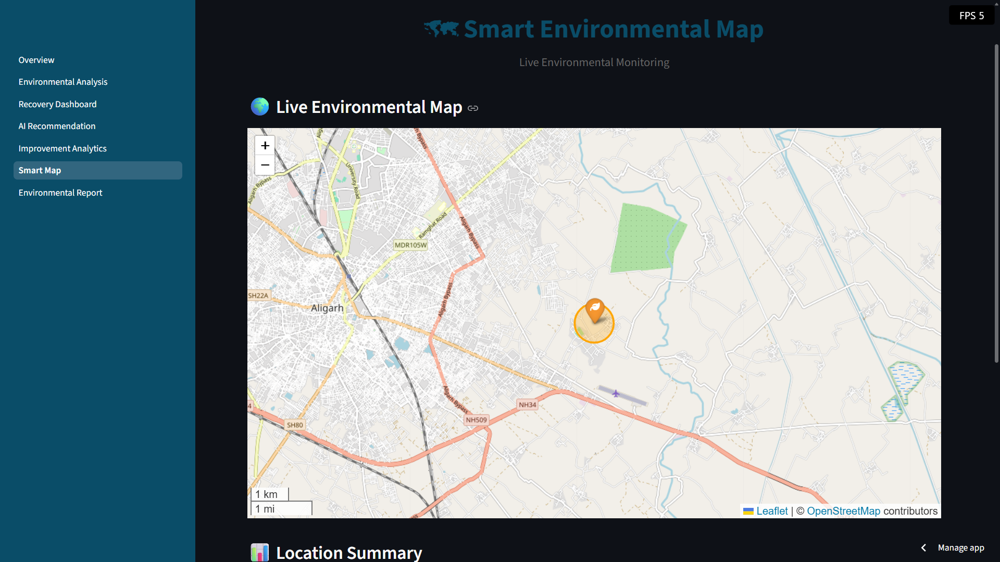
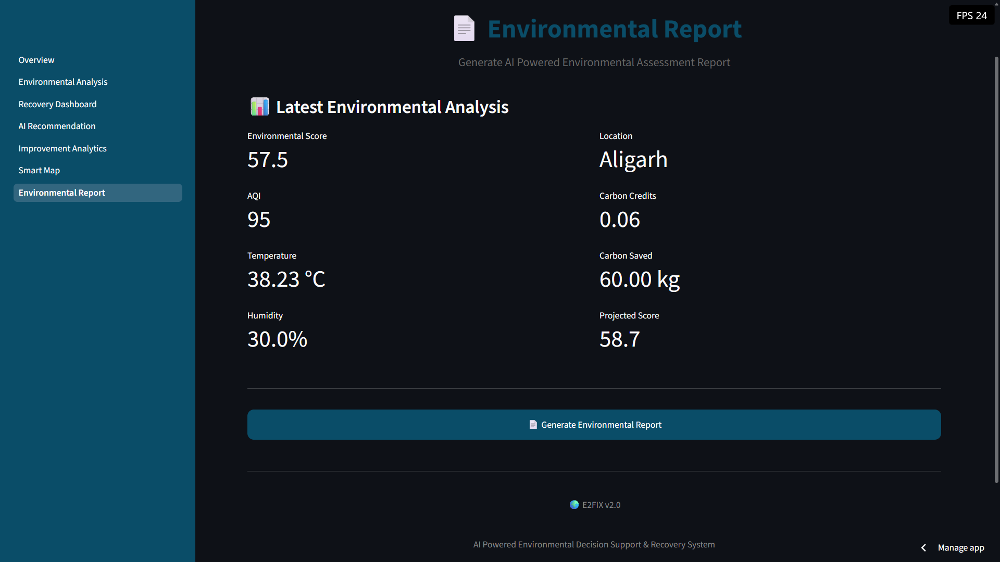

<p align="center">
  
</p>

<h1 align="center">🌍 E2FIX</h1>

<p align="center">
AI Powered Environmental Decision Support System
</p>

<p align="center">
  
  
  
  
</p>

An AI-powered environmental monitoring and decision support platform that analyzes real-time environmental conditions using Air Quality Index (AQI), Weather Data, Carbon Tracking, Waste Management, Green Cover Analysis, Water Availability, Noise Levels, and Heat Impact to generate intelligent environmental insights and professional reports.

---

## 🎯 Project Objective

E2FIX is an AI-powered environmental decision support system that helps users monitor environmental conditions, evaluate pollution levels, estimate environmental recovery, and generate professional sustainability reports using real-time environmental data.

## 🚀 Live Demo

<p align="center">
<a href="https://e2fix-ai.streamlit.app">
<b>🌍 Launch E2FIX Live Demo</b>
</a>
</p>

---


## 🎥 Project Demo

<p align="center">
  
</p>


## ⭐ Key Features

- 🌍 Environmental Analysis Dashboard
- 🌫️ Real-Time AQI Monitoring
- 🌦️ Weather Data Integration
- 🌱 Green Impact Analysis
- 🔊 Noise Pollution Analysis
- 💧 Water Stress Analysis
- ♻️ Waste Management Analysis
- 🔥 Heat Impact Analysis
- 📊 Environmental Score Calculation
- 🤖 AI Powered Recommendations
- 🌿 Carbon Credit & Recovery System
- 📈 Improvement Analytics Dashboard
- 🗺️ Smart Environmental Map
- 📄 Professional PDF Report Generator
- 💾 Environmental History Database

---
# 📌 Key Modules

E2FIX consists of seven major modules:

- 🌍 **Overview Dashboard** – Central dashboard with environmental summary.
- 📊 **Environmental Analysis** – Calculates environmental score using AQI, weather, waste, green cover, water, heat, and noise.
- ♻️ **Recovery Dashboard** – Displays recovery metrics, projected environmental score, and carbon credits.
- 🤖 **AI Recommendation Engine** – Generates intelligent recommendations based on environmental conditions.
- 📈 **Improvement Analytics** – Visualizes environmental indicators using interactive charts.
- 🗺️ **Smart Map** – Select and analyze locations using an interactive map.
- 📄 **Environmental Report** – Generates a professional PDF report with analytics and recommendations.

---
# 🛠 Technology Stack

| Category | Technologies |
|----------|--------------|
| Language | Python |
| Framework | Streamlit |
| Database | SQLite |
| Data Processing | Pandas |
| Visualization | Plotly, Folium |
| Report Generation | ReportLab |
| APIs | OpenWeather API, WAQI API, OpenStreetMap Nominatim |
| Version Control | Git & GitHub |
| Deployment | Streamlit Community Cloud |

---

# 📂 Project Structure

```text
E2FIX/
│
├── Overview.py                  # Main application entry
├── assets/                      # CSS, images, logo
├── components/                  # Reusable UI components
├── data_layer/                  # API services
├── database/                    # SQLite database operations
├── logic_layer/                 # Environmental scoring & AI logic
├── pages/                       # Streamlit pages
├── reports/                     # PDF report generator
├── utils/                       # Helper functions
├── waste_layer/                 # Carbon & waste management
├── requirements.txt
└── README.md
```

---

# ⚙️ Installation & Setup

### 1️⃣ Clone the Repository

```bash
git clone https://github.com/vrprateek18/E2FIX.git
```

### 2️⃣ Navigate to the Project Directory

```bash
cd E2FIX
```

### 3️⃣ Install Dependencies

```bash
pip install -r requirements.txt
```

### 4️⃣ Create a `.env` File

Create a `.env` file in the project root and add:

```env
OPENWEATHER_API_KEY=YOUR_OPENWEATHER_API_KEY
AQI_API_TOKEN=YOUR_WAQI_API_TOKEN
```

### 5️⃣ Run the Application

```bash
streamlit run Overview.py
```

---

# ☁️ Deployment

The application is deployed using **Streamlit Community Cloud**.

Before deployment, configure the following secrets:

```toml
OPENWEATHER_API_KEY="YOUR_OPENWEATHER_API_KEY"
AQI_API_TOKEN="YOUR_WAQI_API_TOKEN"
```
---
# 🏗 System Architecture

<p align="center">
  
</p>

## 📸 Application Screenshots

Below are some screenshots demonstrating the major modules of E2FIX.

## 🏠 Overview

<p align="center">
  
</p>

---

## 🌍 Environmental Analysis

<p align="center">
  
</p>

---

## ♻️ Recovery Dashboard

<p align="center">
  
</p>

---

## 🤖 AI Recommendation

<p align="center">
  
</p>

---

## 📈 Improvement Analytics

<p align="center">
  
</p>

---

## 🗺 Smart Map

<p align="center">
  
</p>

---

## 📄 Environmental Report

<p align="center">
  
</p>

---

# 📊 Project Workflow

```
Location Selection
      │
      ▼
Weather API + AQI API
      │
      ▼
Environmental Analysis
      │
      ▼
Environmental Score
      │
      ▼
AI Recommendation
      │
      ▼
Recovery Dashboard
      │
      ▼
PDF Report Generation
```

---

# 🔮 Future Improvements

- User Authentication
- Admin Dashboard
- ESG Compliance Dashboard
- Machine Learning-Based Prediction
- IoT Sensor Integration
- Mobile Application
- Cloud Database Integration
- Multi-user Collaboration

---

# 👨‍💻 Developer

**Prateek Verma**

B.Tech Computer Science Engineering

- 💻 GitHub: https://github.com/vrprateek18
- 🌍 Repository: https://github.com/vrprateek18/E2FIX

---

# ⭐ Support

If you like this project, don't forget to ⭐ the repository.

---

# 📄 License

This project is licensed under the MIT License. See the LICENSE file for details.